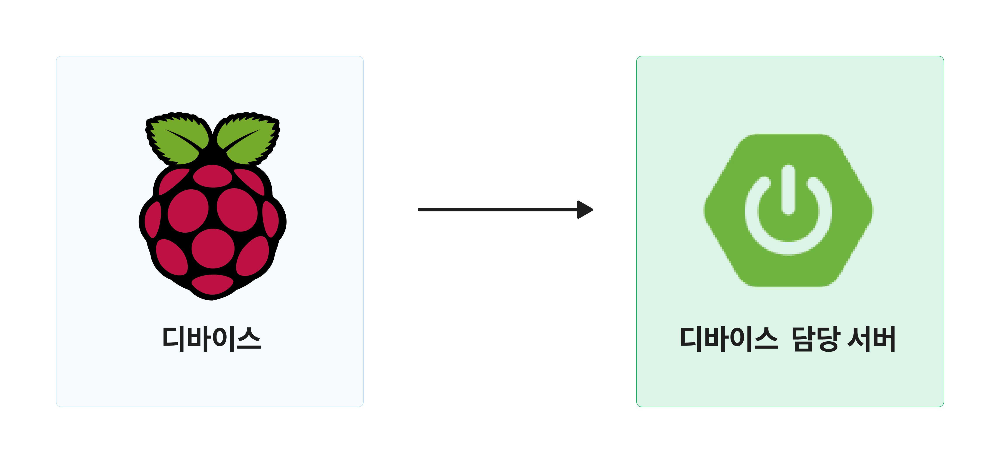
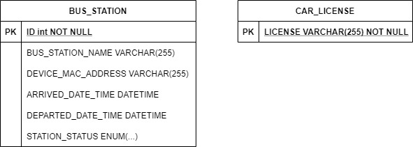
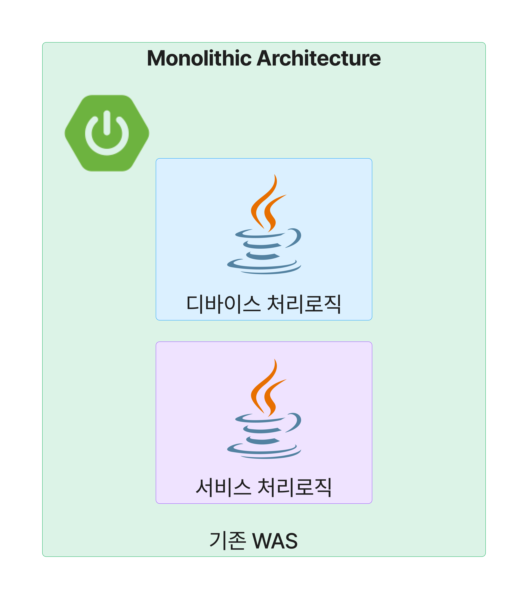
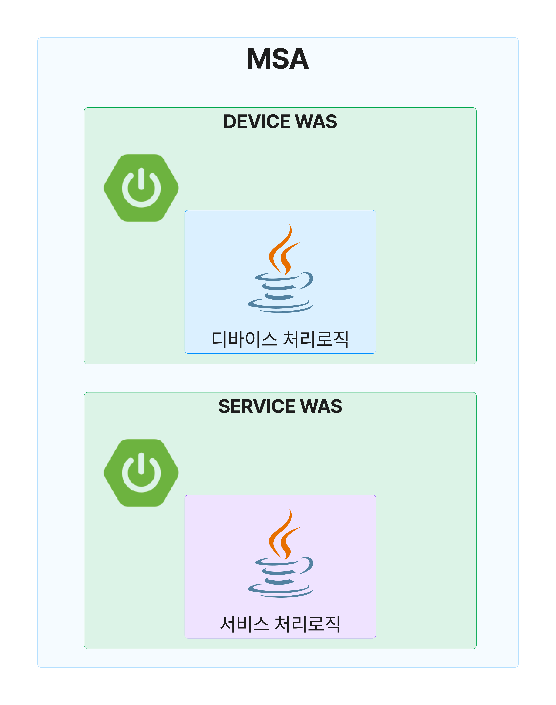
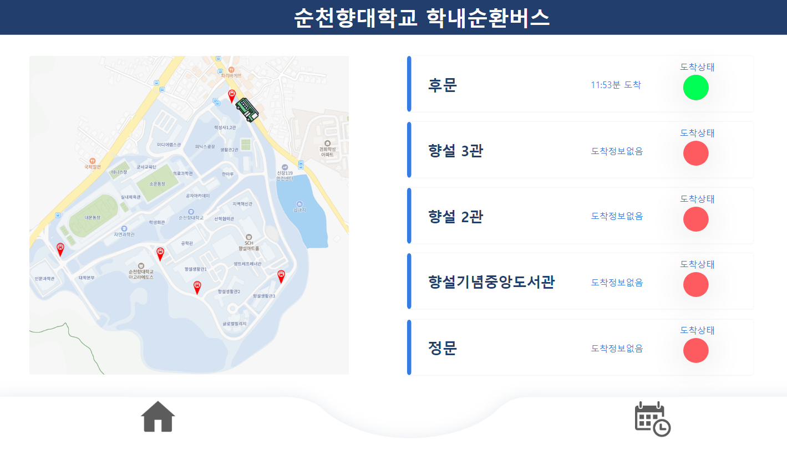
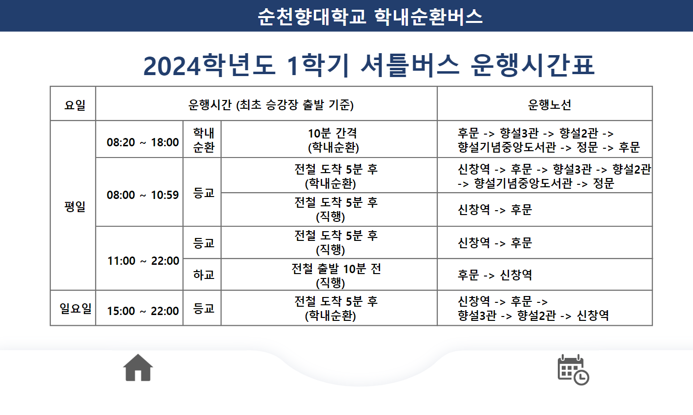
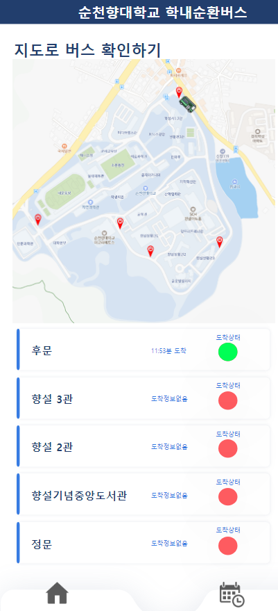
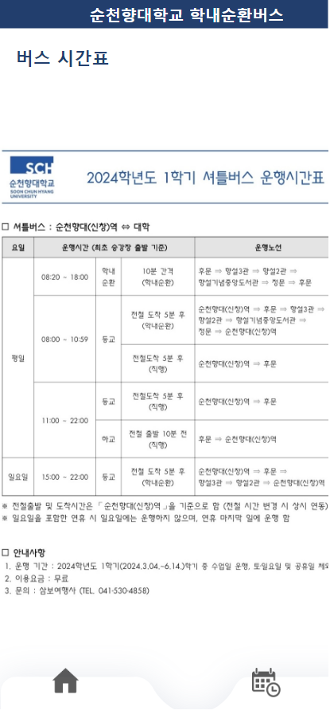

# 순천향대학교 학내순환버스 도착/출발 정보 서비스
순천향대학교 학내순환버스의 정류장별 도착 및 출발 정보를 사용자에게 제공해주는 서비스

## 기능 동작 시나리오
1. 각 정류장에 설치된 디바이스가 서버로 데이터를 전송
2. 서버에서는 디바이스에서 보낸 데이터를 검증한 후, DB에 저장

## 서비스 동작 시나리오
1. 클라이언트가 서버에 페이지를 요청
2. 서버는 클라이언트 요청환경을 분석하여, 환경에 맞는 리소스에 접근
3. 서버에서는 DB의 데이터를 View에 담아 클라이언트에게 전달

## 팀원소개
|팀장|팀원|팀원|팀원|
|:-:|:-:|:-:|:-:|
|**서버/인프라**|디바이스|OCR|UX/UI|
|**황제연**|유용기|권호윤|장승종|

## 백엔드 파트 기술 스택
### Server/DB
- Java 17
- Spring boot
- Spring data JPA
- MariaDB
- Thymeleaf
- Gradle
- Junit5
- Jacoco

### Monitoring
- Prometheus
- Grafana
- Grafana Alert

### INFRA
- Nginx
- Docker
- Docker-compose
- AWS EC2
- AWS RDS
- AWS Route53
- AWS VPC

### 스택 정리

## 백엔드 서비스 아키텍처

## 서버 기능
### 디바이스 담당 서버

- 디바이스 요청 데이터 검증 기능
- 검증 통과한 디바이스 요청 데이터 DB 업데이트 기능

### 서비스 담당 서버

- DB정보를 View에 담아 클라이언트에게 제공하는 기능
- 클라이언트 요청 환경에 따른 UI 분류 기능 (모바일 접속 클라이언트와 PC/패드 접속 클라이언트 구분)

## 서버 성능 개선
- 검증 과정에서 발생하는 불필요한 쿼리 횟수 축소 (5회 -> 3회)
- Controller에 중복되어 있는 기능 템플릿 클래스로 분리/통합 리팩토링

## DB ERD 

### TABLE 설계
#### BUS_STATION
- ID PK -- 인조키 (AUTO_INCREMENT)
- DEVICE_MAC_ADDRESS -- 정류장 디바이스 MAC주소
- ARRIVED_DATE_TIME -- 정류장 도착 시간
- DEPARTED_DATE_TIME -- 출발 도착 시간
- STATION_STATUS -- 정류장 상태 정보(ARRIVED | DEPARTED | TBD)

#### CAR_LICENSE
- LICENSE PK -- 자연키 / 차량 번호판 정보

## Infra 기능
- 도메인명으로 사용자가 접속할 수 있는 배포환경 구축
- 안정적인 성능과 보안 개선이 가능한 백엔드 서버 아키텍처 설계
- 안정적인 서비스 운영을 위한 모니터링 환경 구축

## Nginx 웹서버 설치
- WAS가 DMZ 영역에 노출되는 것을 막기 위해 WAS와 웹서버 분리
- 웹서버로 Nginx 선택 및 설치
- AWS VPC로 NGINX 80번 포트로만 접속하도록 설정
- 사용자의 요청은 NGINX가 처리하고 실제 로직은 NGINX가 WAS에게 요청하고 응답받는 리버스 프록시 서버 구축

## 인프라 성능 개선
### 서버 아키텍처 설계 개선
#### (기존)모놀리식 아키텍처

- 기존 서버 아키텍처는 서비스 요청과 디바이스 요청을 하나에서 처리하는 모놀리식 아키텍처 서버로 구축함
- **But,** Ngrinder 부하 테스트 진행 중, 서비스 요청(GET)이 많아질 경우 디바이스 요청(PATCH)의 처리가 지연되는 문제 발견 

#### MSA 아키텍처로 변경

- Spring boot의 profile 기능을 활용하여, 프로필 별로 기능이 다르게 동작하는 2개의 WAS로 분리 설계
- 사용자의 요청(GET)이 많아져도 디바이스 요청(PATCH)에 큰 영향이 없도록 개선

### 정리
- 서버 아키텍처의 구조적인 변화로 처리 지연 시간을 단축 (3.4s -> 1.2s)

## 모니터링 기능
- 분리된 WAS별로 Metric을 수집할 수 있는 Prometheus 구축
- 각 WAS의 수집정보를 한눈에 볼 수 있는 Grafana 대시보드 구축
- 개인 이메일과 연동하여 위급상황을 신속하게 알려줄 수 있는 Grafana Alert 구축

## Prometheus 설정
- 부하를 줄이면서, 적절하게 데이터를 수집하기 위해 1m 단위로 수집하도록 설정

## Grafana 대시보드 기능
### 공통
- 서버 지속시간
- CPU/프로세스 사용량
- 로그 타입별 요청 증가량
- 톰캣 스레드 활성화 정보
- HicariCP 커넥션 풀 활성화 정보
- 페이지별 요청 증가량

### WAS별 기능
- GET 요청 증가량 (서비스 WAS)
- PATCH 요청 증가량 (디바이스 WAS)

## Grafana Alert 규칙
### (공통) pending 30초 이상 지속될 경우 Alert 발생
- 서버가 꺼진 상태가 10초 이상 지속될 경우 pending (공통)
- CPU 사용량이 50% 이상일 경우 pending (공통)
- Device 담당 WAS의 요청 증가가 25 이상인 경우 pending (디바이스 WAS만)

## 배포 과정
- Docker를 활용하여 각 서버별 별도의 격리된 환경 구축
- Docker-Compose를 작성하여 각각의 Docker를 Docker-Network로 연결하는 배포 환경 구축
- 서버와 모니터링 환경은 AWS EC2에 배포, 데이터베이스는 AWS RDS에 배포
- AWS Route53으로 미리 가비아에서 구매해둔 도메인명과 매칭시켜서 해당 도메인 명으로 접속 가능하도록 설정

## 최종 배포 서버 (비용 문제로 현재 삭제)
- 도메인명: www.sch-busstation.store
- 도착/출발 정보 페이지: http://www.sch-busstation.store/sch/station/page
- 시간표 페이지: http://www.sch-busstation.store/sch/station/timetable

## 접속 화면
### PC/패드 접속 유저 화면
#### 정류장 페이지
  

#### 시간표 페이지
  

### Mobile 접속 유저 화면

#### 정류장 페이지  
  

#### 시간표 페이지  
  

## 동작 이벤트
### 정류장에 도착한 경우

### 정류장에서 출발한 경우

### 정문 정류장 출반 전

### 정문 정류장 출발 후

- 누적된 정류장 출발 시간 정보 초기화

### 후문 정류장 도착 전

### 후문 정류장 도착 후

- 누적된 정문 정류장 출발 시간 정보 초기화

## 기타: 
- 세부 기능과 최적화 과정 등에 관한 내용은 개인 블로그에 업로드 중  
  개인 블로그: https://velog.io/@hwangjeyeon/posts
- 디바이스/통신 기능은 설명 생략

